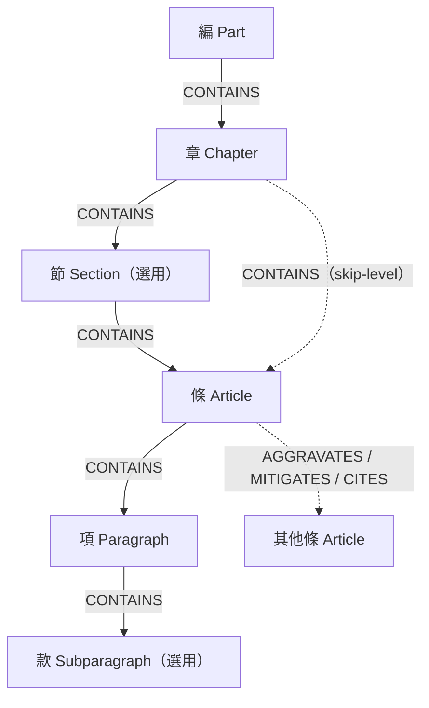

# 中華民國刑法知識圖譜 (Knowledge Graph) — 建置技術文件

> 用途:說明本專案如何把《中華民國刑法》全文轉成一張結構化知識圖譜,作為後續 RAG 系統的骨架。
> 資料法規異動日期:2026-03-13　|　目標資料庫:Neo4j Aura

> ⚠ **版本注意(2026-07 v2 改版)**:本文件第 4–8 章描述的是 **v1 六層模型**,現行架構已改為
> **三層結構(編 Part → 章 Chapter → 條 Article)+ 第四層語意事實(Fact)**:
>
> - 「節」不建節點;「項/款」全文合併入 `Article.text`;未遂/預備改為 Article 布林屬性
> - 已刪除條文標記 `is_deleted: true`(20 條);列舉條/加重結果犯之關係修正已內建 parser
> - 第四層:`extraction/extract_facts.py` 以法條句式規則(中文 OpenIE)抽取 SPO 三元組,
>   涵蓋總則 §1–99(選抽)+ 殺人/傷害罪章,共 143 個 Fact
>   (謂詞白名單 12 種:法定刑/刑之加重/刑之減免/未遂處罰/加重結果/訴追條件/
>   定義/不罰/科刑限制/保安處分/沒收/處罰依據),
>   Fact 節點以 `EXTRACTED_FROM` 回連 Article,刑度並正規化為結構化屬性
>
> 現行模型與統計以 [README](../README.md) 為準;本文件保留作 v1 設計理由與方法紀錄。

---

## 1. 專案目標 (Objective)

把《中華民國刑法》整部法典(總則 + 分則)轉換成一張可查詢、可推理的**知識圖譜 (Knowledge Graph, KG)**,作為檢索增強生成 (Retrieval-Augmented Generation, RAG) 系統的知識骨架。

相較於把法條切塊丟進向量資料庫的「純向量 RAG」,知識圖譜能額外表達法條之間的**結構關係**(哪一條加重哪一條、哪一條引用哪一條),讓系統回答「殺害直系血親尊親屬如何量刑」這類問題時,可以沿著「§271 → §272 加重」的關係多跳檢索,而不只是找文字相似的段落。

---

## 2. 設計理念 (Design Rationale)

本專案採「**法條當骨架 (backbone)、關係掛在骨架上**」的設計,主要決策如下:

- **以法典原生結構為骨架。** 法律條文本身就是高度結構化的階層資料(編→章→條…),不需要人工設計本體 (ontology);直接沿用法典結構即可得到乾淨、穩定的圖骨架。
- **暫不使用超邊 (n-ary hyperedge)。** 法律的「多條件法律效果」本質上是多元關係,但本階段先用標準二元邊 (binary edge) 的屬性圖 (property graph) 建模;需要表達多條件規則時,改用**中介節點 (reification)** 而非超圖,以降低實作複雜度。HyperGraphRAG 式的 n-ary 表示法列為後續選項。
- **關係抽取採啟發式 + 人工複核。** 階層(骨架)用規則精準切分;法條之間的橫向引用因為散落在自然語言條文裡,改用關鍵字啟發式 (heuristic) 抽取,再以人工複核修正(見第 7 節)。

---

## 3. 資料來源 (Data Source)

| 項目 | 內容 |
|---|---|
| 法規 | 中華民國刑法 |
| 主管來源 | 全國法規資料庫 (law.moj.gov.tw),pcode = `C0000001` |
| 實際取得管道 | 社群專案 `kong0107/mojLawSplitJSON`(將 MOJ 開放資料拆分為單一法規 JSON) |
| 取用檔案 | `FalVMingLing/C0000001.json` |
| 格式 | 中文鍵 JSON,欄位名稱保留 MOJ 原始用字 |

**為什麼不直接從 MOJ 網站下載:** 全國法規資料庫的單一法規頁面只提供 PDF / RTF / ODT 等「給人看的排版格式」,沒有現成的結構化 JSON。上述社群 repo 已把 MOJ 開放資料轉成乾淨的逐法規 JSON,且欄位沿用原始中文鍵,直接可用。

**來源 JSON 結構:** 最外層為一個物件,關鍵欄位是 `法規名稱` 與 `法規內容`。`法規內容` 是一個串列,每個元素是以下兩種之一:

```json
{ "編章節": "第 二十二 章　殺人罪" }                    // 階層標題行
{ "條號": "第 271 條", "條文內容": "殺人者,處死刑…" }   // 條文
```

整部刑法共 422 個條文、56 個編章節標題行。

---

## 4. 資料模型 — 6 層階層 (Data Model)

### 4.1 六層定義

圖的骨架完全對應法典本身的六層結構:

| 層 | 中文 | 英文 | Neo4j Label | 說明 |
|---|---|---|---|---|
| 1 | 編 | Part | `Part` | 總則 / 分則 |
| 2 | 章 | Chapter | `Chapter` | 如「殺人罪」 |
| 3 | 節 | Section | `Section` | **選用層**,多數章無節 |
| 4 | 條 | Article | `Article` | 如「第271條」 |
| 5 | 項 | Paragraph | `Paragraph` | 條內分項 |
| 6 | 款 | Subparagraph | `Subparagraph` | **選用層**,項內列舉款目 |

「節」與「款」是**選用層 (optional)**:沒有該層時直接 skip-level(例如殺人罪章沒分節,「章」就直接接「條」),不塞空節點。

### 4.2 節點屬性 (Node Properties)

每個節點共用以下屬性:

| 屬性 | 說明 |
|---|---|
| `code` | 全域唯一鍵,例 `刑法-271`、`刑法-271-項1` |
| `title` | 顯示標題 |
| `number` | 編/章/條/項/款序號(字串,容納 `272-1`) |
| `order` | 同層排序用 |
| `level` | `編`/`章`/`節`/`條`/`項`/`款` |
| `law` | 法規名稱(供日後接其他法典) |
| `text` | 規範文字,只掛在最底層的葉節點(條或項或款) |

### 4.3 `code` 命名規則(關鍵設計)

`code` 是節點的唯一鍵,命名規則必須保證**全域唯一**,這裡有一個容易踩雷的地方:

- **條 (Article)**:刑法的條號是**全法典連續編號**(第1條到第363條),本身唯一 → `刑法-271`。
- **章 (Chapter)**:章號在**每一編會重新編號**(總則有第一章「法例」、分則也有第一章「內亂罪」),且存在「第五章之一」「第十六章之一」這種子章。若只用章號當 code 會**互相覆蓋**。因此章的 code 必須**用編範圍化、並納入「之X」**:`刑法-編1-章5`、`刑法-編2-章5-1`。
- **項 / 款**:掛在所屬條/項底下,沿用上層 code:`刑法-271-項1`、`刑法-271-項1-款2`。

> ⚠ 此規則是本專案修正過的一個 bug:最初章 code 沒範圍化,導致 54 章被併成 36 章。修正後才正確還原 54 章。

### 4.4 關係型別 (Relationship Types)

關係分兩類。第一類是**階層骨架**,只有一種邊:

- `CONTAINS`:`(上層)-[:CONTAINS]->(下層)`,構成 6 層樹。

第二類是**橫向引用**,跨在骨架之上、表達條文之間的法律關係:

| 關係 | 意義 |
|---|---|
| `AGGRAVATES` | 加重(如 §272 對 §271 加重) |
| `MITIGATES` | 減輕 / 特別減輕構成要件(如 §273 義憤殺人) |
| `CITES` | 單純引用其他條文 |
| `PUNISHES_ATTEMPT` | 未遂犯之處罰(指向基礎項) |
| `PUNISHES_PREPARATION` | 預備犯之處罰(指向基礎項) |
| `LISTS` | 中性「列舉性引用」(管轄/免刑/告訴乃論清單,見第 7 節) |

### 4.5 圖示



---

## 5. 處理流程 (Pipeline)

### 5.1 全貌

```
MOJ JSON (C0000001.json)
        │
        ▼
  Parser (moj_law_to_kg.py)   ← 切階層、抽引用、做中文數字轉換
        │
        ▼
  Cypher 批次腳本 (UNWIND)     ← 節點一段、關係一段
        │
        ▼
  Neo4j Aura                   ← 載入
        │
        ▼
  資料品質清理 (cleanup.cypher) ← 修正啟發式誤判
        │
        ▼
  乾淨可查詢的知識圖譜
```

### 5.2 Parser 邏輯 (`moj_law_to_kg.py`)

1. **中文數字轉換 (`cn2int`)**:把「二百七十一」轉成 271。條號本身是阿拉伯數字,但內文引用是中文數字,故需轉換。
2. **走訪 `法規內容`**:維護目前的「編 / 章 / 節」堆疊。遇到 `編章節` 行就更新堆疊;遇到 `條號` 行就建立 `Article`,掛在最近的節(無節則掛章)。
3. **切分項 / 款**:把 `條文內容` 依換行切成「項」;以中文序數(「一、」「二、」)開頭的行視為「款」,掛在前一項底下。單句無分項的條,文字直接掛在條(葉節點)。
4. **交叉引用抽取**(見 5.3)。
5. **輸出**:組成 `UNWIND` 批次的 Cypher。

### 5.3 交叉引用抽取 (Cross-reference Extraction)

用正規表達式 (regex) 從條文中找出引用,並分類:

- **絕對引用**:`第○○○條(之○)?(第○項)?`,例「犯第二百七十一條第一項之罪」。
- **相對引用**:`前條`(指向前一條)、`前項`(指向前一項)。
- **關係分類(啟發式)**:看引用附近的關鍵字 —「加重」→`AGGRAVATES`、「減輕」→`MITIGATES`、「未遂」→`PUNISHES_ATTEMPT`、「預備」→`PUNISHES_PREPARATION`,其餘預設 `CITES`。

> 這一步是整個流程中唯一非確定性的部分,因此需要第 7 節的人工複核。

---

## 6. 載入 Neo4j (Loading)

目標庫為 Neo4j Aura Free。載入分三步,**順序很重要**:

1. **約束 (constraints)**:對六種 label 的 `code` 建唯一性約束。
2. **節點**:用 `UNWIND` 批次建立全部 1,228 個節點。
3. **關係**:用 `UNWIND` 批次建立全部關係。

兩個實作注意事項:

- **schema 與 data 不可同一交易**:`CREATE CONSTRAINT`(schema)必須和 `MERGE`(data)分開執行,否則 Neo4j 會報錯。
- **每段包成單一 statement**:Aura 的 Query 編輯器一次只執行一段 statement,故把「所有節點」「所有關係」各包成一整段(內部用 `WITH count(*) AS _` 串接多個 `UNWIND`),避免只跑到一半。

---

## 7. 資料品質與清理 (Data Quality & Cleanup)

### 7.1 已知的啟發式誤判

關係分類靠關鍵字,會在「列舉型條文」上出錯。典型例子:

- **§61(情節輕微得免刑)**:它列了一串適用免刑的罪名,被誤判成對每條「`MITIGATES`」,還把同段出現的「直系血親尊親屬」錯掛成 condition。
- **§5 / §6(域外管轄)**:列出「在國外犯這些罪也適用本法」的清單,被誤判成 `AGGRAVATES` / `CITES`。
- **告訴乃論條文(§287、§319 等)**:列出「⋯⋯之罪須告訴乃論」的清單,被誤判成 `CITES`。

### 7.2 清理做法 (`cleanup.cypher`)

分三段、由保守到積極:

1. **診斷(只看)**:列出對外連出大量同型關係的條文(列舉型嫌疑犯)、列出所有帶 condition 的邊。
2. **安全自動修**:清掉 `CITES` 上被誤掛的 condition(單純引用不該帶構成要件)。
3. **人工確認後降級**:把確認是列舉型的條文(§5、§6、§61、§287、§308、§319、§236、§243、§245、§357、§363),其誤標的 `AGGRAVATES`/`MITIGATES`/`CITES` 邊**降級為中性的 `LISTS`** — 保留「有提到」的事實,但拿掉錯誤的法律語意。

> 重要原則:**不一股腦亂刪**。像 §226、§226-1、§280 這類「對多個基礎罪真加重」的條文,連出度雖高但語意正確,清理時刻意排除。

### 7.3 清理結果

本次共把 62 條誤標關係降級為 `LISTS`(§5 的 17 條、§61 的 15 條、§6 + 告訴乃論的 30 條),並清掉 `CITES` 上的錯誤 condition。關係總數不變(只是重新貼標),但剩下的 `AGGRAVATES` / `MITIGATES` 已是乾淨可信的真加重 / 真減輕。

---

## 8. 最終圖譜統計 (Final Statistics)

**節點 1,228 個:**

| Label | 數量 |
|---|---|
| Paragraph(項) | 628 |
| Article(條) | 422 |
| Subparagraph(款) | 122 |
| Chapter(章) | 54 |
| Part(編) | 2 |

**關係 1,524 條:**

| 關係 | 中文 | 數量 |
|---|---|---|
| CONTAINS | 包含(階層) | 1,226 |
| CITES | 引用 | 107 |
| PUNISHES_ATTEMPT | 未遂處罰 | 95 |
| LISTS | 列舉(中性) | 62 |
| AGGRAVATES | 加重 | 15 |
| MITIGATES | 減輕 | 12 |
| PUNISHES_PREPARATION | 預備處罰 | 7 |

---

## 9. 已知限制 (Known Limitations)

- **關係分類為啟發式**:換別的法規重跑時,列舉型條文仍可能誤判,需重新複核。
- **引用精度只到「條」**:「第○條第○項」目前連到該「條」,尚未精確連到「項」。要項級精度需改 parser 重抽。
- **2 條 dangling 引用被略過**:§319-6 → 不存在的「項1」、§98 → 不存在的「§121-1」,載入時 `MATCH` 找不到節點而自動略過(未進資料庫)。
- **未連結總則的計算規則**:目前分則的「加重½」「未遂處罰」尚未連到總則的依據條文(§25 未遂定義、§64–73 加減例)。

---

## 10. 後續工作 (Next Steps)

1. **檢索入口**:在條文 `text` 上建全文索引,或產生向量嵌入 (embeddings) + 向量索引,作為 RAG 的檢索入口。
2. **情境檢索查詢**:給定條號或關鍵字 → 沿 `CONTAINS` 取階層脈絡、沿 `AGGRAVATES`/`MITIGATES`/`CITES` 取相關條文,組成 LLM 的 context。
3. **接上總則**:把 §25、§64–73 等總則條文連進來,讓加重/未遂的推理鏈完整。
4. **(進階)多條件規則**:對「未滿七歲 + 凌虐 → 死刑」這類多條件法律效果,改用中介節點 (reification) 或 HyperGraphRAG 的 n-ary 表示法。

---

## 附錄:檔案清單 (Deliverables)

| 檔案 | 用途 |
|---|---|
| `moj_law_to_kg.py` | 主 parser:MOJ JSON → Cypher |
| `A_nodes_oneshot.cypher` | 全部節點(單段 UNWIND) |
| `B_rels_oneshot.cypher` | 全部關係(單段 UNWIND) |
| `cleanup.cypher` | 三段式資料品質清理 |

### 範例查詢

```cypher
// 殺人罪整章 + 加重/減輕/引用關係
MATCH (c:Chapter {title:'殺人罪'})-[:CONTAINS]->(a:Article)
OPTIONAL MATCH (a)-[r:AGGRAVATES|MITIGATES|CITES]->(a2)
RETURN c, a, r, a2;

// 第271條的完整出身(編→章→條)
MATCH path = (:Part)-[:CONTAINS*]->(:Article {number:'271'})
RETURN path;
```
